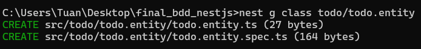

**Viết API theo hướng BDD trong nestjs**

Tương tự như viết theo hướng TDD.
[Xem tại đây](https://github.com/tuantyler/NestJS-TDD-Example)

Ta có 2 file test

test.feature

bdd.steps.ts

Ta sử dụng jest-cucumber để thực hiện viết test theo BDD

npm install jest-cucumber --save-dev

Vào package.json , tìm đến key testRegex , sửa từ regex từ dùng đuôi
spec sang steps

Trong file bdd.test.steps.ts

Ta import hai thư viện của jest-cucumber

Và load file feature để parse và chạy senario test

Chạy npm để chạy test

Báo lỗi thiếu TodoModule

Chạy nest g module todo

Chạy lại test, báo lỗi thiếu TodoEntity

Chạy nest g class todo/todo.entity

Chạy test, báo lỗi thiếu Controller

Chạy nest g controller todo

Chạy test, báo lỗi thiếu thư viện typeorm

Chạy npm install --save @nestjs/typeorm typeorm mysql

Chạy test, báo lỗi thiếu sqllite

Chạy npm install better-sqlite3

Chạy test, báo lỗi thiếu context cho EntityRepository

Thêm context cho Entity

Chạy test, báo lỗi 404, routes chưa được defined trong controller

Define các route cần thiết và viết functions , sử dụng Repository để
thực hiện truy cập database

Chạy test, báo lỗi entity chưa được defined

Define Entity

Chạy lại test

